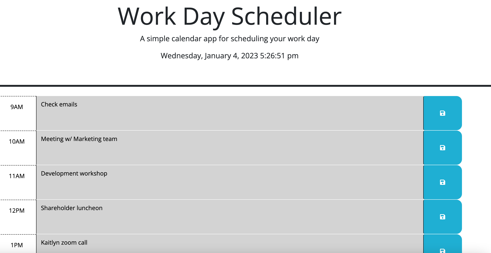

# Work Day Planner App

## Description

This project implements an original JS script over HTML starter code and layout design, with significant expansion to HTML as well. The exercise demonstrates the expanded DOM-manipulation capabilities of JavaScript with the utilization of the jQuery API, and the use of the Day.js API to make date/time-context-dependent updates to the page itself.

As the page's subheader suggests, this is a simple day-planner app for someone with a regular 9-5 schedule, however I included the 5PM time block too since we all know how work is liable to run over sometimes! When the page is viewed during business hours, self-evident color coding in each 1-hour time block indicates whether it is in the past, present, or future relative to the current hour. After business hours, all time blocks will show as being in the past, while they will show as being in the future before business hours. Upon each hour, this automatically updates. Each time block can be clicked and receive text input, i.e. schedule items the user wishes to record. To save these inputs, the user can click the adjacent save button so they remain on the planner even if the page is reloaded. Near the top of the page, the current date and time is displayed. 

## Installation

N/A

## Usage

The user can save and edit events to record in the day planner's individual 1-hour time blocks. These blocks show as green if they are in the future, red if they are on the current hour, or grey if they've already passed (on a given day). Notably, if the user has previously saved input to a time block, then made unsaved changes in the same block, and the page auto-updates on the hour, those unsaved changes will not be overwritten, just as long as the user doesn't reload the page. To view the deployed page, [click here](https://altavada.github.io/day-planner-app/).

## Credits

N/A

## License

Refer to license in the repo.
